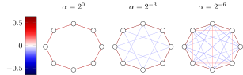

# fLode: <ins>f</ins>ractional <ins>L</ins>aplacian graph neural <ins>ode</ins>
+ [Introduction](#introduction)
+ [Fractional heat and Schrödinger equations](#fractional-heat-and-schrödinger-equations)
+ [Experiments](#experiments)
    - [How to run the code](#how-to-run-the-code)
    - [Summary of the results](#summary-of-the-results)
+ [Cite Us](#cite-us)

## Introduction
In this work, we consider the symmetrically normalized adjacency $\mathbf{L}$ for directed graphs. We show theoretically that it generalizes well-known properties of the usual definition on undirected graphs. 

We then define the $\alpha$-fractional Laplacian $\mathbf{L}^\alpha$ using singular value calculus. The key insight is that singular values are always positive, hence, their fractional powers are always well-defined. Moreover, the SVD is more stable and accurate than the Jordan decomposition, which would be required with the usual definition.




As shown in the picture, the $\alpha$-fractional Laplacian admits both positive and negative entries, and it is able to connect distant nodes. Intuitively, this is very useful for heterophilic graphs, i.e., when nodes are more likely to be connected to nodes belonging to a different class.


## Fractional heat and Schrödinger equations
We consider the fractional Laplacian heat equation $\mathbf{x}'(t) = -\mathbf{L}^\alpha \mathbf{x}(t) \mathbf{W}$ and the fractional Laplacian Schrödinger equation $\mathbf{x}'(t) = i\mkern1mu\mathbf{L}^\alpha \mathbf{x}(t) \mathbf{W}$ with initial condition $\mathbf{x}(0)=\mathbf{x}_0$, where $\mathbf{x}_0$ are the node features and $\mathbf{W}$, $\alpha$ are the learnable parameters. We theoretically show that by selecting a learnable $\alpha$, fLode is able to adapt the convergence speed of the graph's Dirichlet energy, making it well-suited for both directed and undirected graphs, and for a broad range of homophily levels.


Real-world graphs are not purely homophilic (bottom right) nor purely heterophilic (bottom left), but lie somewhere in between (bottom center). Hence, the ability to adapt the convergence speed and the limit frequency $\lambda$ is important to enhance performances for the task and graph at hand.


# Experiments
## How to run the code
Clone the repository:
```
git clone git@github.com:RPaolino/fLode.git
```
Please check the dependencies and the required packages, or create a new environment from the `environment.yml` file
```
conda env create -f environment.yml
conda activate flode
```
To run the experiments, for example, on `chameleon`, type:
```
python main.py --dataset chameleon
```
If you want to use the best hyperparams we found, you can use the flag `-b`: this will overwrite the default values with the values saved in `lib.best`. You can specify your own configuration via command line. For a complete list of all arguments and their explanation, type:
```
python main.py -h
```
## Summary of the results
The test accuracy of our method on real-world graphs is shown below. In the paper, one can find a comparison with other models.
|               | film | squirrel | chameleon | Citeseer | Pubmed | Cora|
| :---------------- | :---------: | :---------: | :---------: | :---------: | :---------: | :---------: |
| Undirected | 37.16 ± 1.42 | 64.23 ± 1.84 | 73.60 ± 1.55 | 78.07 ± 1.62 | 89.02 ± 0.38 |86.44 ± 1.17 |
| Directed   | 37.41 ± 1.06 | 74.03 ± 1.58 | 77.98 ± 1.05 | - | - | - |


In order to give a rough idea of the computational time, we report the time needed to compute the SVD and the training time. The GPU is a `NVIDIA TITANRTX` with `24 GB` of memory. Note that we considered the undirected graphs. Moreover, for Pubmed we computed only 30% of the singular values due to memory (and time) limitations.
|               | film | squirrel | chameleon | Citeseer | Pubmed | Cora|
| :---------------- | :---------: | :---------: | :---------: | :---------: | :---------: | :---------: |
| #Nodes  | 7,600  |  5,201 | 2,277|  3,327 | 18,717  | 2,708  |
| SVD [mm:ss] |   02:55   | 01:30 | 00:03 | 00:03 | 07:46 | 00:04 |
| Training [iters/sec] | 5 | 4 | 10 | 8 | 4 | 15|
# Cite Us
If you find this work interesting, please cite us.

