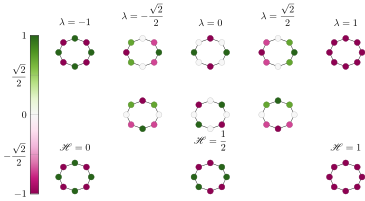

# A Fractional Graph Laplacian Approach to Oversmoothing
[](https://arxiv.org/abs/2305.13084)
+ [Introduction](#introduction)
+ [Dirichlet Energy and Laplacian for (Directed) Graphs](#dirichlet-energy-and-laplacian-for-directed-graphs)
+ [Fractional Graph Laplacian](#fractional-graph-laplacian)
+ [Fractional Graph ODE](#fractional-graph-ode)
+ [Experiments](#experiments)
    - [How to run the code](#how-to-run-the-code)
    - [Caveat](#caveat)
+ [Cite Us](#cite-us)

# Introduction
Let $\mathcal{G}=(\mathcal{V}, \mathcal{E})$ be a graph with vertices $\mathcal{V}$ and edges $\mathcal{E}$; let $N=\lvert \mathcal{V}\rvert$ be the number of nodes. Define:
- the adjacency matrix $\mathbf{A}\in\{0, 1\}^{N\times N}$ such that $a_{i, j}=1$ if there is an edge from node $j$ to node $i$;
- the in-degree matrix $\mathbf{D}_1 \coloneqq \mathrm{diag}(\mathbf{A}\mathbf{1})$;
- the out-degree matrix $\mathbf{D}_0 \coloneqq \mathrm{diag}(\mathbf{A}^\top\mathbf{1})$;
- the nodes' feature matrix $\mathbf{x}\in\mathbb{R}^{N\times K}$.

#  Dirichlet Energy and Laplacian for (Directed) Graphs
We define the ``Dirichlet Energy`` for directed graphs as 
$$\mathfrak{E}(\mathbf{x})\coloneqq \dfrac{1}{4}\sum\limits_{i, j=1}^N a_{i,j}\left\lVert \dfrac{\mathbf{x}_i}{\sqrt{d_i^{\text{in}}}} - \dfrac{\mathbf{x}_j}{\sqrt{\smash[b]{d_j^{\text{out}}}}} \right\rVert.$$

We define the ``symmetrically normalized adjacency`` (SNA) as 
$$\mathbf{L}\coloneqq \mathbf{D}_1^{-\frac{1}{2}} \mathbf{A} \mathbf{D}_0^{-\frac{1}{2}}.$$

In the paper, we show theoretically that both definitions are extensions of the usual definitions for the undirected case. More specifically,
- the spectrum of the SNA lies in the unit circle, i.e., $\lvert\lambda(\mathbf{L})\rvert \leq 1$;
- the Dirichlet Energy and the SNA are related by $\mathfrak{E}(\mathbf{x})=\frac{1}{2}\Re\left(\mathrm{trace}\left(\mathbf{x}^\text{H} (\mathbf{I}-\mathbf{L}) \mathbf{x}\right)\right)$

Unlike the undirected case, $1$ is not necessarily an eigenvalue of $\mathbf{L}$; hence, the minimum of $\mathfrak{E}$ is not necessarily $0$. In the paper, we give a full characterization of the cases in which $1\in\lambda(\mathbf{L})$.

# Fractional Graph Laplacian

We define the $\alpha$-fractional Laplacian $\mathbf{L}^\alpha$ using singular value calculus. If $\mathbf{L}=\mathbf{U}^\text{H}\mathbf{\Sigma}\mathbf{V}$ is the singular value decomposition of $\mathbf{L}$, then
$$
\mathbf{L}^\alpha \coloneqq \mathbf{U}^\text{H}\mathbf{\Sigma}^{\alpha}\mathbf{V}
$$
The key insight is that singular values are always positive; hence, their fractional powers are always well-defined. Moreover, the SVD is more stable and accurate than the Jordan decomposition, which would be required with the usual definition in the singular-value domain.


In the paper, we prove that the $\alpha$-fractional Laplacian can generate virtual edges among far-distant nodes. Intuitively, this is very useful for heterophilic graphs, i.e., when nodes are more likely to be connected to nodes belonging to a different class.


# Fractional Graph ODE
We consider the fractional Laplacian ode $\mathbf{x}'(t) = -i\mkern1mu\mathbf{L}^\alpha \mathbf{x}(t) \mathbf{W}$ with initial condition $\mathbf{x}(0)=\mathbf{x}_0$, where $\mathbf{x}_0$ are the node features and $\mathbf{W}$, $\alpha$ are the learnable parameters. We discretize it using an explicit Euler scheme, obtaining the update rule
$$
\mathbf{x}_{t+1} = \mathbf{x}_t-i\mkern1mu \, h\, \mathbf{L}^\alpha \mathbf{x}_t \mathbf{W}
$$
We theoretically show that by selecting a learnable $\alpha$, fLode is able to adapt the convergence speed of the graph's Dirichlet energy, making it well-suited for both directed and undirected graphs, and for a broad range of homophily levels.



Real-world graphs are not purely homophilic (bottom right) nor purely heterophilic (bottom left), but lie somewhere in between (bottom center). Hence, the ability to adapt the convergence speed and the limit frequency $\lambda$ is important to enhance performances for the task and graph at hand.


# Experiments

The test accuracy of our method on real-world graphs is shown below. In the paper, one can find a comparison with other models.
|               | film | squirrel | chameleon | Citeseer | Pubmed | Cora|
| :---------------- | :---------: | :---------: | :---------: | :---------: | :---------: | :---------: |
| Undirected | 37.16 ± 1.42 | 64.23 ± 1.84 | 73.60 ± 1.55 | 78.07 ± 1.62 | 89.02 ± 0.38 |86.44 ± 1.17 |
| Directed   | 37.41 ± 1.06 | 74.03 ± 1.58 | 77.98 ± 1.05 | - | - | - |


In order to give a rough idea of the computational time, we report the time needed to compute the SVD and the training time. The GPU is a `NVIDIA TITANRTX` with `24 GB` of memory. Note that we considered the undirected graphs. Moreover, for Pubmed we computed only 30% of the singular values due to memory (and time) limitations.
|               | film | squirrel | chameleon | Citeseer | Pubmed | Cora|
| :---------------- | :---------: | :---------: | :---------: | :---------: | :---------: | :---------: |
| #Nodes  | 7,600  |  5,201 | 2,277|  3,327 | 18,717  | 2,708  |
| SVD [mm:ss] |   02:55   | 01:30 | 00:03 | 00:03 | 07:46 | 00:04 |
| Training [iters/sec] | 5 | 4 | 10 | 8 | 4 | 15|
## How to run the code
Clone the repository:
```
git clone git@github.com:RPaolino/fLode.git
```
Please check the dependencies and the required packages, or create a new environment from the `environment.yml` file
```
conda env create -f environment.yml
conda activate flode
```
To run the experiments, for example, on `chameleon`, type:
```
python node_classification.py --dataset chameleon
```
If you want to use the best hyperparams we found, you can use the flag `-b`: this will overwrite the default values with the values saved in `lib.best`. To see which argument will be overwritten, please check the dataset in `lib.best`. 
```
python node_classification.py --dataset chameleon -b
```

You can specify your own configuration via command line. For a complete list of all arguments and their explanation, type:
```
python node_classification.py -h
```

## Caveat
- When loading the dataset, we use the `pre_transform` argument. This allows to compute the SVD as a preprocessing step. Normally, if the code executes without any issues, it automatically deletes the processed files at the end. However, in the event of an interruption, the processed graph might not be deleted. In such cases, please ensure to manually remove it to avoid potential overwrites or unexpected results.
- The ``--real`` flag must be used in conjunction with ``--equation h`` or ``--equation mh``.
# Cite Us
If you find this work interesting, please cite us
```
@misc{maskey2023fractional,
      title={A Fractional Graph Laplacian Approach to Oversmoothing}, 
      author={Sohir Maskey and Raffaele Paolino and Aras Bacho and Gitta Kutyniok},
      year={2023},
      eprint={2305.13084},
      archivePrefix={arXiv},
      primaryClass={cs.LG}
}
```

